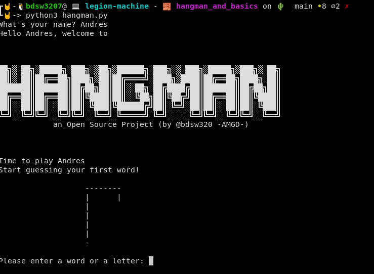

# Juego del Ahorcado - Hangman Game

El juego es un juego del ahorcado como el que todos conocemos en donde tenemos que adivinar una palabra y si no adivinamos algunas letras, lo que pasará es que se le comenzarán a dibujar partes del cuerpo a nuestro muñequito, cuando se completen las partes del cuerpo significa que perdimos, pero si acompletamos la palabra antes de que el muñequito esté completo, eso significa que hemos ganado.

El juego no tiene un interfaz gráfica como tal, corre en la terminal, pero si tenemos dibujado al muñequito junto con mensajes de bienvenida y avisos de derrota o victoria.

Un ejemplo a continuación:

